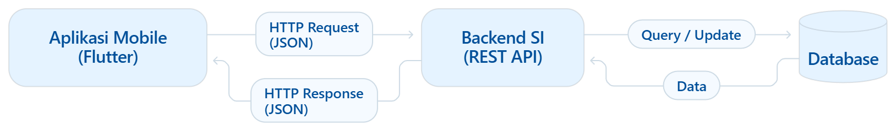

# Tugas 1 — Identifikasi Kebutuhan Aplikasi Bergerak

### Aplikasi Mobile Perpustakaan Kampus

|                    |                        |
| :----------------- | :--------------------- |
| **Nama**           | Tira Azzahra           |
| **NIM**            | 230660221021           |
| **Kelas**          | SI-VIIA                |
| **Domain SI**      | Perpustakaan Kampus    |

---

## Daftar Isi

1. [Deskripsi Sistem](#1-deskripsi-sistem)
2. [Diagram Arsitektur](#2-diagram-arsitektur)
3. [Tabel Kebutuhan](#3-tabel-kebutuhan)
4. [Bukti Environment Siap](#4-bukti-environment-siap)
5. [Refleksi](#5-refleksi)

---

## 1. Deskripsi Sistem

### Pengguna

- **Mahasiswa** — pengguna utama aplikasi.
- **Petugas Perpustakaan** — pengguna pendukung (pengelolaan data dari sisi backend).

### Permasalahan

1. Mahasiswa harus datang langsung ke lokasi perpustakaan hanya untuk mengecek ketersediaan buku.
2. Mahasiswa sering terlambat mengembalikan buku karena tidak ada sistem pengingat tenggat.

### Alasan Memilih Aplikasi Mobile

| Karakteristik Mobile | Penerapan pada Sistem |
| :--- | :--- |
| **Sesi penggunaan singkat** | Mahasiswa mengakses dari ponsel, sehingga pengecekan ketersediaan buku harus selesai dalam beberapa langkah sentuhan. |
| **Konteks bergerak** | Mahasiswa beraktivitas cepat di area kampus, sehingga membutuhkan pengingat yang tersampaikan langsung di ponsel. |
| **Konektivitas terbatas** | Sinyal di area kampus bisa tidak stabil, sehingga data katalog buku tetap dapat dilihat secara offline melalui penyimpanan lokal. |

---

## 2. Diagram Arsitektur

> **File sumber:** `diagram.mmd` (Mermaid)

**Alur komunikasi:**

1. Aplikasi mengirim **HTTP Request** ke backend.
2. Backend melakukan query atau perubahan data pada **database**.
3. Database mengembalikan hasil ke backend.
4. Backend mengirim **HTTP Response** kembali ke aplikasi.

---

## 3. Tabel Kebutuhan

| No. | Permintaan | Pengguna | Karakteristik Mobile yang Terkait | Fitur Aplikasi | Materi Pemenuh |
| :---: | :--- | :---: | :--- | :--- | :---: |
| 1 | Melihat daftar katalog buku beserta detail stoknya | Mahasiswa | Layar kecil dan sesi singkat: informasi harus ringkas dan cepat ditemukan | Halaman daftar katalog dan detail buku | `Minggu 3, 5` |
| 2 | Meminjam buku secara mandiri dari aplikasi | Mahasiswa | Interaksi sentuh: peminjaman selesai dalam beberapa langkah mudah | Form peminjaman buku dengan tombol kirim | `Minggu 6, 9–10` |
| 3 | Menerima pengingat otomatis sebelum masa peminjaman berakhir | Mahasiswa | Konteks bergerak: informasi penting disampaikan langsung ke ponsel | Local notification pengingat tenggat | `Minggu 11` |
| 4 | Menampilkan katalog dan riwayat peminjaman saat sinyal jelek | Mahasiswa | Konektivitas terbatas: koneksi internet di lokasi kampus bisa tidak stabil | Penyimpanan lokal (cache) data buku | `Minggu 7` |
| 5 | Mengambil foto Kartu Tanda Mahasiswa (KTM) untuk verifikasi akun | Mahasiswa | Kapabilitas perangkat: mengambil gambar secara langsung dari ponsel | Fitur ambil foto / kamera | `Minggu 11` |
| 6 | Mengelola master data buku, stok, dan laporan statistik peminjaman | Petugas | Tidak berlaku (pekerjaan sisi server dan panel kelola web) | Di luar lingkup (backend SI) — CRUD data dan laporan di REST API | Di luar PAB (Prak-backend, Basis Data) |

> **Catatan Lingkup:** Baris 1–5 dikerjakan pada aplikasi mobile, sedangkan baris 6 menjadi tugas backend SI; aplikasi mobile hanya menampilkan hasilnya.

---

## 4. Bukti Environment Siap

| Bukti | File |
| :--- | :--- |
| `flutter doctor -v` sebelum perbaikan | `flutter-doctor/sebelum.png` |
| `flutter doctor -v` sesudah perbaikan | `flutter-doctor/sesudah.png` |
| Aplikasi counter berjalan (target web, Chrome) | `aplikasi.png` |

---

## 5. Refleksi

> **Fitur perangkat yang paling relevan: *Local Notification***

Fitur ini memberikan pengingat otomatis secara langsung ke layar ponsel mahasiswa beberapa hari sebelum masa pengembalian buku berakhir. Dengan adanya notifikasi ini, mahasiswa dapat mengembalikan buku tepat waktu sehingga terhindar dari denda keterlambatan.

---

**Tira Azzahra — 230660221021 — SI-VIIA**

